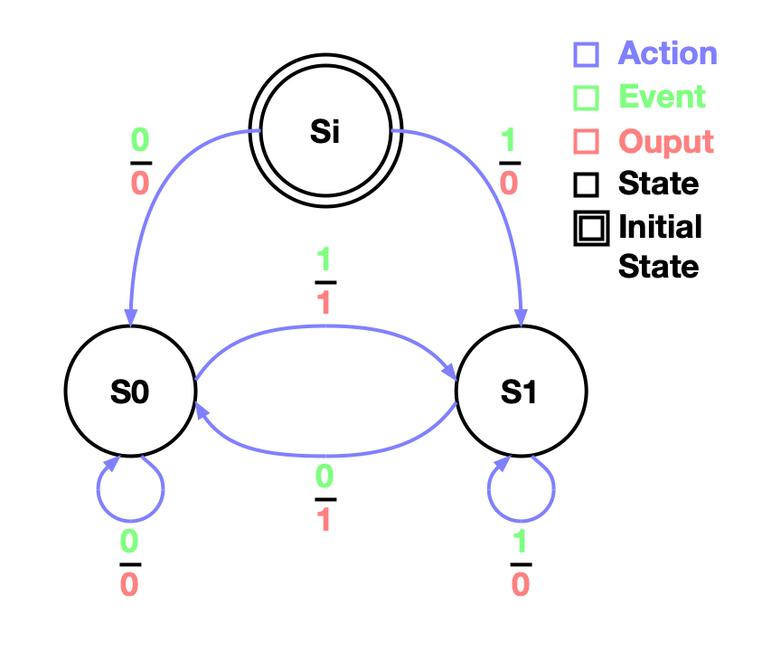
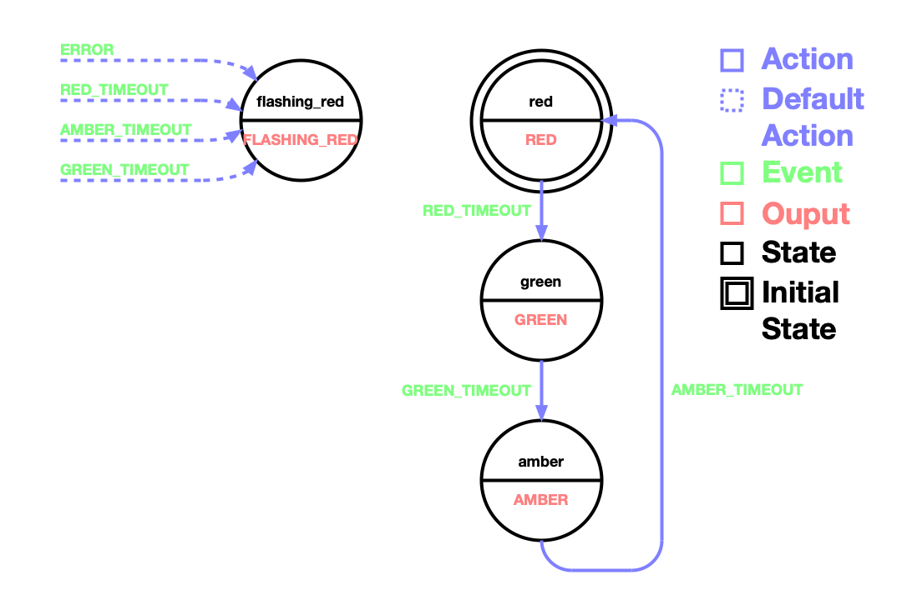

# statmech

## Pythonic Finite State Machine

State machines represent different states and the transition between states that have a repetitive sequence
that is pre-determined.
Examples are many appliances (kettle, toaster, etc.),
machines in general (traffic lights, factory automation, etc.), and
stateful software (UI screens, wizards, etc.).
These are very broad categories of uses and therefore state machines are common.

A frequent characteristic of a state machine is that the input events arrive asynchronously and therefore adding
a formal structure is useful otherwise the code becomes difficult to understand, debug, and maintain.
You can 'roll-your-own' state machine; but using a pre-tested module, like this one,
is both easier and more reliable.
In particular, error handling is very tricky to get right.

At a top (most abstract) level state machines are easy to code, just:

  1. List the inputs (events).
     Actually a set of events because you can't have repeats.
     Also the set is finite, i.e. can't have an infinite number of inputs.
     In practice state machine's are only practical if the number of events is less than about 100.
  2. List the states.
     Again actually a set, no repeats.
     Again only practical up to a few 100.
  3. List the transitions from one state to the next in response to an event and at the same time give the new output.
  
The above requirements are often represented as a state diagram, which is great to document code (see example diagrams below).

### Instalation

The code is written in Python 3.5 and is designed run on [MicroPython](https://micropython.org) 
(making it suitable for real hardware) as well as desktop (normal) Python.
All the code is in one small file (``statmech.py``).

  1. pip install --update statmech
  2. Copy ``statmech.py`` into your project.

### Terminology Used in this Module

  1. The overall state machine is a ``Machine``.
  2. The state machine has ``States``.
  3. Inputs to the machine are events, which are typically enum members.
  4. The response of a ``State`` to an event is an action, which is a tuple of the new state and the output value.
  5. Events are ``fired`` into the ``Machine`` and the actions give the new states and new outputs.

### Making a State Machine

The steps to make a state machine are:

  1. Define input events, typically using an enum or class with just class attributes.
  2. Define outputs,
     which is often an enum but could be as complicated as a function to execute to obtain a derived value.
  3. Define states (class ``State``).
  4. Define actions (tuples of new state and new value)
     to take when events fire (add actions to states and machine).
  5. Define a ``Machine`` using a ``with`` statement.
  6. Fire events into machine and obtain outputs.
  
E.g. an edge detector
(it detects when its input changes from 0 to 1 or vice versa and outputs a 1 if it does, otherwise a 0):



States are traditionally draw as circles and the initial state is marked with a double circle (shown in black).
States traditionally have an identifier, because it is easier to follow what is happening if a state is uniquly identified.
The identifiers are inside the circles representing the states.
Actions are the arrows from one state to the next (shown in blue).
Inputs that cause the action to be taken are above the line on the action annotation (shown in green).
Outputs that result when the action is taken are below the line on the action annotation (shown in red).
    
```python
Bit = enum.Enum('Bit', 'ZERO ONE')  # 1. & 2. Define the inputs (in this case also the outputs).

s_i: typing.Final = State(ident='i')  # 3. Define the states.
s_0: typing.Final = State(ident=0)
s_1: typing.Final = State(ident=1)

s_i.actions = {Bit.ZERO: (s_0, Bit.ZERO), Bit.ONE: (s_1, Bit.ZERO)}  # 4. Define the actions.
s_0.actions = {Bit.ZERO: (s_0, Bit.ZERO), Bit.ONE: (s_1, Bit.ONE)}
s_1.actions = {Bit.ZERO: (s_0, Bit.ONE), Bit.ONE: (s_1, Bit.ZERO)}

with Machine(initial_state=s_i) as machine:  # 5. Define the machine.
    assert machine.state is s_i
    assert machine.fire(event=Bit.ZERO) is Bit.ZERO  # 6. Fire events and obtain outputs.
    assert machine.state is s_0
    assert machine.fire(event=Bit.ZERO) is Bit.ZERO
    assert machine.state is s_0
    assert machine.fire(event=Bit.ONE) is Bit.ONE
    assert machine.state is s_1
    assert machine.fire(event=Bit.ONE) is Bit.ZERO
    assert machine.state is s_1
    assert machine.fire(event=Bit.ZERO) is Bit.ONE
    assert machine.state is s_0
```

Note how the startup is dealt with, initially outputting a 0 for either input.
This special start up condition is achieved using a
start up state that is not used again after the first event is fired.
This unique startup state is a common feature of state space machines.

The edge detector is an example of a state machine that has an output associated with each action,
these are called Mealy Machine (see below) and they use the class ``State`` to define their states.

A more complicated example is a traffic light machine:


    
This state diagram has three features that are different than the edge detector diagram:

  1. The output is ascotiated with the state not the action, i.e. all transition to a given state result in the same output.
     This is denoted in the diagram by the below the line output shown on the state (in red) and not on the action annotation.
  2. The machine has actions that are the default for all states, shown as a dotted line that does not originate from a state (shown in blue).
     These machine actions are 'overriden' by state actions, hence their dotted nomenclature to indicate lesser.
  3. There is no way out of state 'flashing_red' (it is a terminal failure); other than restarting the machine so that it goes back to 'red'.

The traffic light example has two common requirements: the events arrive asynchronously and it is important (because it is safety critical)
that all events are dealt with even if they arrive unexpectedly.
For example if the traffic light is red and the amber timeout occurs, this is an error because the machine is waiting
for the red timeout not the amber.

Note in the diagram, upper left, how the unexpected events and the error event are dealt with for the whole machine,
rather than coding this requirement on all states individually.
These machine actions can be 'overridden' by a state; so for example when in the red state and
the red timer finished the next state is green, as expected (not an error).

The advantage of the machine dealing with common actions is that the actions of the state machine are much
easier to follow.

```python
class Timeouts(enum.Enum):  # 1. The inputs.
    RED_TIMEOUT = enum.auto()
    AMBER_TIMEOUT = enum.auto()
    GREEN_TIMEOUT = enum.auto()
    ERROR = enum.auto()

class Outputs(enum.Enum):  # 2. The outputs.
    RED = enum.auto()
    AMBER = enum.auto()
    GREEN = enum.auto()
    FLASHING_RED = enum.auto()

flashing_red: typing.Final = StateWithValue(ident='flashing_red', value=Outputs.FLASHING_RED)  # 3. The states.
red: typing.Final = StateWithValue(ident='red', value=Outputs.RED)
amber: typing.Final = StateWithValue(ident='amber', value=Outputs.AMBER)
green: typing.Final = StateWithValue(ident='green', value=Outputs.GREEN)

red.actions[Timeouts.RED_TIMEOUT] = green.action  # 4a. The *state* actions.
green.actions[Timeouts.GREEN_TIMEOUT] = amber.action
amber.actions[Timeouts.AMBER_TIMEOUT] = red.action

with Machine(initial_state=red) as machine:  # 5. The machine.
    machine.actions[Timeouts.RED_TIMEOUT] = flashing_red.action  # 4b. The *machine* actions.
    machine.actions[Timeouts.AMBER_TIMEOUT] = flashing_red.action
    machine.actions[Timeouts.GREEN_TIMEOUT] = flashing_red.action
    machine.actions[Timeouts.ERROR] = flashing_red.action

    assert machine.state is red
    assert machine.fire(event=Timeouts.RED_TIMEOUT) is Outputs.GREEN  # 6. Fire events and obtain outputs.
    assert machine.state is green
    assert machine.fire(event=Timeouts.GREEN_TIMEOUT) is Outputs.AMBER
    assert machine.state is amber
    assert machine.fire(event=Timeouts.AMBER_TIMEOUT) is Outputs.RED
    assert machine.state is red
    assert machine.fire(event=Timeouts.AMBER_TIMEOUT) is Outputs.FLASHING_RED
    assert machine.state is flashing_red
    assert machine.fire(event=Timeouts.ERROR) is Outputs.FLASHING_RED
    assert machine.state is flashing_red
```

Note how the defining actions in this case are split between state actions, 4a, and machine actions, 4b,
which makes the code shorter, easier to maintain, and easier to debug.

The traffic light machine is an example of a state machine that has an output associated with each state,
these are called Moore Machine (see below) and they use the class ``StateWithValue`` to define their states.

For more state machine examples see ``test_statmach.py``.

### Pythonic Aspects of this Module

  1. ``Machine`` is a ``State`` (inheritance), so that machines can be nested.
  2. ``State`` and hence ``Machine`` are context managers which allows for enter and exit code and error handling.
  3. Use Python ``with`` for executing a ``Machine``.
  4. Warnings (python ``warnings`` module) can optionally be issued if input events handled changes during execution.

### Formal Definition

The state machine implemented is a Mealy machine, see https://en.wikipedia.org/wiki/Mealy_machine,
but a Moore Machine, the other common type of state machine, can also be easily represented see ``StateWithValue``.
The formal definition of a Mealy machine is a 5-tuple (S, S0, Σ, Λ, T) that consisting of the following:

  * A finite set of states S.
    Class ``State`` represents a state.
  * A start state (also called initial state) S0 which is an element of S.
    When a ``Machine`` is created it must be given an initial state.
  * A finite set called the input alphabet Σ.
    Inputs are unique objects, typically members of an enum.
  * A finite set called the output alphabet Λ.
    The output is any type.
  * A combined transition and output function T : S × Σ → S × Λ.
    The transitions are actions on each state that are called when the corresponding event fires,
    the actions give the new state and new output.

In the strictest sense the state machine implemented by this module is superset of a Mealy Machine because:

  1. The code does not enforce that there are a fixed set of: states (S), events (Σ), etc. and these sets can be
     added to or removed from whilst executing the machine.
  2. Both the machine and the state classes can be extended to add extra fields to them
     (thus giving extra state that is not part of the state machine 'per se').
  3. Has extensive error control via Python exceptions and handling in ``__exit__``.
  4. Has machine actions that can be 'overridden' by state actions.
  5. The machine is also a state and therefore machines can be nested.

